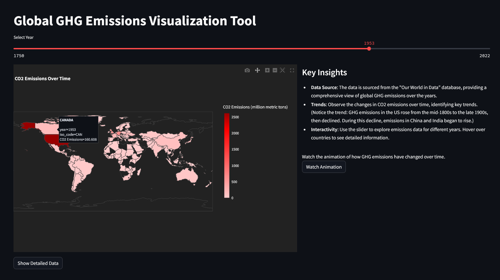

# Streamlit Apps Portfolio

This repository contains a collection of Data applications I've built using Streamlit(Python) as a  part of my portfolio. 
I have completed five apps so far and plan to add one new app each week.

You can find the link to the individual applications below.

## Overview

  
  

### App 1: Stock Analysis Dashboard

The Stock Analysis Dashboard is a Streamlit application designed to provide users with the ability to chart the prices of individual stocks and compare the performance of two different stocks. The app fetches data via API calls, including stock prices, financial statements, and news articles related to the stocks.

Added another feature for portfolio tracking.

Link to the app: [Stock Analysis Dashboard](https://portfolio-track.streamlit.app/)

### App 2: Energy Forecasting

This app conducts energy forecasting based on past consumption data. It adapts Rob Mulla's energy forecasting project to work with any file containing energy data, provided the first column is the date and the second is the energy consumption value.

**Technical Highlights:**
- Developed a frontend using Streamlit, allowing users to input their own files into the data model. 💻
- Generated plots to display hourly and monthly power consumption trends. 📈
- Implemented XGBoost for future predictions by training the model on historical data.

Link to the app: [Energy Forecasting](https://energyco.streamlit.app/)

### App 3: Global GHG Emissions Visualization Tool

This Streamlit app highlights my GIS plotting skills by visualizing global greenhouse gas emissions. Users can interact with a detailed world map that displays CO2 and other GHG emissions by country, equipped with a time slider to observe changes over the years. It provides in-depth details on emissions, population, and GDP for a comprehensive understanding of each country's environmental impact.

**Technical Highlights:**
- Utilizes advanced GIS plotting to represent complex geographical data visually.
- Interactive elements like a time slider enhance user engagement and data exploration.
- Provides a comparative analysis tool for countries, supporting environmental research and education.

### App 4: Currency Conversion Product

This app simplifies financial transactions by enabling real-time currency conversion. Users can select from a list of global currencies and input amounts to see converted values based on current exchange rates, making it ideal for travelers and finance professionals.

**Technical Highlights:**
- Incorporates real-time financial APIs to fetch the latest currency exchange rates.
- Offers a user-friendly interface for quick and easy currency conversions.
- Employs robust error handling to ensure reliable and accurate conversions.

### App 5: Breast Cancer Predictor

This Streamlit-based app helps diagnose breast cancer by analyzing cell nuclei measurements from tissue samples.

https://cancerpredictionn.streamlit.app/

**Key Features:**
- **Interactive Sliders**: Adjust the values for various cell nuclei measurements, including Radius (mean), Texture (mean), Perimeter (mean), Area (mean), Smoothness (mean), and more.
- **Prediction**: Utilizes a Logistic Regression model to predict whether a breast mass is benign or malignant.
- **Visualizations**: Displays dynamic radar charts that visualize the mean, standard error, and worst values for each measurement.

**Technical Highlights:**
- **Logistic Regression**: Used for reliable and interpretable predictions.
- **joblib**: Efficiently saves and loads the trained model. joblib is a powerful tool for serializing Python objects, which is essential for saving machine learning models and pipelines. This allows the model to be easily reused and deployed without the need to retrain it every time, ensuring consistency and saving time.
- **User-Friendly Interface**: Built with Streamlit to provide an intuitive user experience.

Special thanks to Alejandro AO for simplifying this project.

## Future Plans

I am planning to add one new app each week, covering various domains and functionalities. Stay tuned for more updates!

---

This is an ongoing project, and I am excited to continue developing and enhancing this portfolio. Feedback and contributions are welcome!
