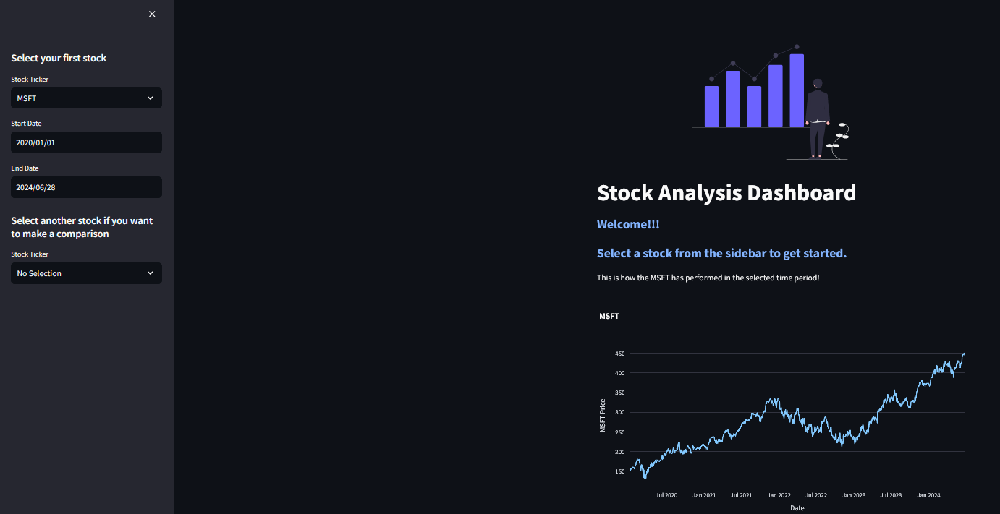

# Repository overview:
This repository contains a collection of small Streamlit apps developed as part of my portfolio projects. 
I am honing my skills as a data product manager by iteratively developing these apps, continuously adding new features and improvements. 
Through these projects, I am also tracking and implementing the latest technologies to create impactful and user-friendly data applications.

## Project Overview

The application is a versatile and user-friendly tool designed for tracking stock performance and managing investment portfolios. 
It leverages the power of Streamlit to provide an interactive and intuitive user experience.
I am developing these apps iteratively, adding new features and improvements over time.

# Stock Analysis Dashboard

#Vision:

As a data product manager, my vision is to empower individual investors and financial enthusiasts with a powerful, yet simple-to-use application that demystifies stock performance tracking and portfolio management. 
The goal is to provide users with actionable insights that can help them make informed investment decisions.

#Problem Statement:

Many individual investors struggle with tracking the performance of their stocks and managing their investment portfolios due to the complexity and the lack of accessible tools. 
Many a times, their investments are spread across different applications (Stocks, commodities, crypto etc) and it becomes tough for the user to have a consolidated view of their portfolio performance.
The application aims to bridge this gap by offering an intuitive and comprehensive platform for tracking and managing investments.

## Features

### Current Features

1. **Individual Stock Price Charting**
   - Users can select a stock ticker and view its price chart over a specified time period.
   - Users can choose from a wide range of stock tickers.
   - Users can specify the start and end dates to analyze stock performance over a specific period.
   
  

2. **Comparison of Two Stocks**
   - Users can select two different stock tickers and compare their performance over the same time period using a dual y-axis chart.
   - Get an idea of what your hypothetical return might have been had you invested an 'X' amount in a 'XYZ' stock vs 'ABC' stock.
   

3. **API Integration for fetching financial data**
   - The application makes API calls to fetch stock data, financial statements, and news articles related to the selected stocks.(Due to the API rate limits I've disabled this feature)

4. **Track Portfolio**
   - Users can create and manage their investment portfolios.
   - The application provides various performance metrics to help users understand their portfolio's performance.
   - Users can view historical data and trends for their portfolios.

### Upcoming Features

- Integration of additional financial metrics and indicators.
- Enhanced news sentiment analysis and visualization.
- User authentication and personalized dashboards.

## Usage

### Individual Stock Analysis

1. Select a stock ticker from the sidebar.
2. Choose the start and end dates for the analysis period.
3. View the price chart and performance metrics for the selected stock.

### Comparing Two Stocks

1. Select the first stock ticker and the analysis period.
2. Select the second stock ticker for comparison.
3. View the dual y-axis chart comparing the performance of both stocks.

## Data Sources

The application pulls data from various APIs to provide comprehensive stock analysis:

- **Stock Prices and Financial Statements:** Using APIs such as Alpha Vantage and Yahoo Finance.
- **News Articles:** Integrating news data to provide the latest information related to the selected stocks.

Technology Stack:

    Front-end: Streamlit
    Back-end: Python
    Data Sources: Integration with financial APIs to fetch real-time stock data.

## Contributing

I am continuously working on adding new features and improving the existing ones. If you have any suggestions or would like to contribute to this project, feel free to fork the repository and create a pull request.

This is an ongoing project, and I am excited to continue developing and enhancing the Stock Analysis Dashboard. Stay tuned for more updates!

